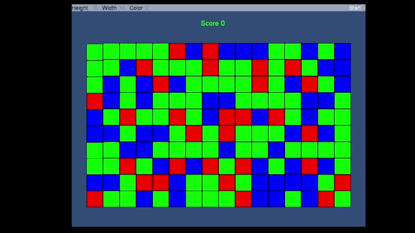

<h1 align=center>Three-on-a-row</h1>

<!-- LINK -->
**Version** - [cocos2dx](https://github.com/cocos2d/cocos2d-x/tree/v3)

## Обязательно реализовать

- [x] Игра должна корректно запускаться на десктопе с разрешением игрового экрана 1280x1024.
- [x] При запуске сразу начинается игра с настройками: ширина = 16, высота = 10, цвета = 3.
- [x] Игровое поле центрируется и масштабируется на весь экран, оставляя небольшой отступ по сторонам.
- [x] При запуске игры игровое поле полностью заполняется блоками со случайно выбранным цветом.
- [x] Подсчет и удаление всех соседних блоков одного цвета: соседними считаются блоки, соприкасающиеся одной стороной.
- [x] Падение оставшихся сверху блоков, заполняющее пустоты после удаления.
- [x] Перезапуск игры по нажатию кнопки “Старт”.

## По желанию можно добавить:
- [ ] Ввод ширины, высоты и количества цветов в интерфейсе игры;
- [ ] Проверку корректности введенных данных;
- [x] Подсчет очков за удаленные блоки;
- [x] Окно завершения игры, когда у игрока не осталось больше ходов;
- [x] Анимацию удаления и падения блоков;
- [ ] Звуковые эффекты;
- [ ] Любую графику на Ваш выбор.
